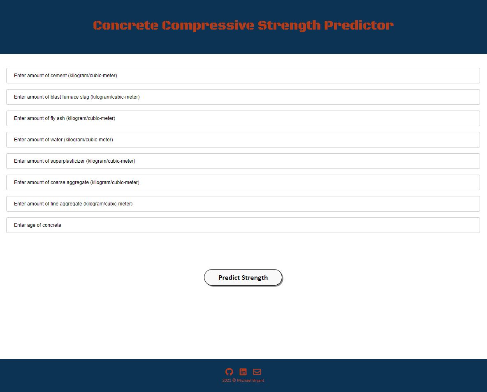

# Heroku Files for Concrete Compressive Strength App

This repository is for hosting the files used to build the [Heroku web app](https://predict-compressive-strength.herokuapp.com/) based on [the analysis and models built on a concrete compressive strength dataset](https://github.com/michaelbryantds/concrete-strength-pred). An image of the front-end is displayed in Figure 1. Below you will find an overview of the code and files.

<div align="center">
  
<figure>
<br/>
  <figcaption>Figure 1: Front end of Heroku app using the XGBRegresor model.</figcaption>
</figure>
<br/><br/>
  
</div>

### Code Used 

**Python Version:** 3.8.11 <br />
**Packages:** pandas, numpy, scipy, sklearn, flask, pickle<br />
**For Web Framework Requirements:**  ```pip install -r requirements.txt```  

## Files

### templates/index.html

This file contains the HTML code used for the front end of the app hosted with Heroku.

### Procfile

This file contains the commands for running the application's containers. It specifies the application server as Gunicorn.

### app.py

This file contains the flask actions and input manipulation performed for the application.

### scaler.pkl

This file is the pickle containing the MinMaxScaler after it had been fit to the training data so that it can transform the user input.

### xgboost_model.pkl

This file is the pickle containing the hyperparameter tuned SVR after being trained on the training data so that it can be applied to the user input.

## Resources

1. [Kaggle: Concrete compressive strength dataset](https://www.kaggle.com/maajdl/yeh-concret-data)


